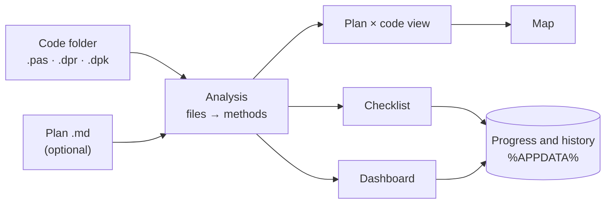

<div align="center">

# CodeManager

**Review, track and plan Delphi projects — folder by folder, file by file, method by method.**

[](LICENSE)
[](docs/DESENVOLVIMENTO.md)
[](docs/DESENVOLVIMENTO.md)
[](README.md)


</div>

CodeManager reads the units of a Delphi project and gives you a simple way to **see what you have**, **review what
has been looked at** and **follow progress over time** — without changing a single line of your code. If you have
a document describing what the project *should* contain, it compares the two.

> The application and most of the documentation are in **Portuguese**. This page is a short English summary.

## Features

- **Map** — the folder → file → method tree, with search, statistics and the **lines and complexity** of each method.
- **Checklist** — mark what you reviewed, what is under review or needs changes, what compiles, what passed Sonar, what is a priority; add notes.
  A file is *done* when **all its methods** are reviewed.
- **Dashboard** — numbers and charts for progress and code distribution, including day-by-day evolution.
- **Plan in Markdown** — write the intended structure (and code) in a `.md` file and see what is implemented,
  what is still missing (`PLANEADO`/planned) and what is extra (`EXTRA`). With no code folder, the document is
  analysed on its own, as if it were the code.
- **Follows your IDE** — re-analyses what you change as you save.
- **Exports** to Markdown, TXT, CSV, JSON, offline HTML pages and paper/PDF.
- **Light and dark themes.**


<sub>The evolution history in the screenshots is demo data; everything else is a real analysis of CodeManager's own source.</sub>

## Getting started

You need Windows 10/11 and, to build, **Delphi 13** with the **Chart4D** package (installed from GetIt).

```bat
git clone <repository-url>
cd CodeManager
build.bat
```

The executable is `out\bin\Win64\Release\CodeManager.exe` (a single file, no installer). Then, on the **Project**
page, name the project, pick its root folder and click **Analisar projeto** (*Analyse project*).

## How it works



The analysis engine does not depend on the UI or on Windows; the FireMonkey interface is drawn in code and follows
the theme. The application **only reads** the project it analyses. Your progress is stored in
`%APPDATA%\CodeManager`.

## Documentation (Portuguese)

- [User guide](docs/GUIA-DO-UTILIZADOR.md)
- [Plan format](docs/FORMATO-DO-PLANO.md)
- [Architecture](docs/ARQUITETURA.md)
- [Development](docs/DESENVOLVIMENTO.md)
- [Contributing](CONTRIBUTING.md) · [Changelog](CHANGELOG.md)

## License

[MIT](LICENSE). Charts use [Chart4D](https://github.com/GDKsoftware/Chart4D) (MIT) — see
[THIRD-PARTY-NOTICES.md](THIRD-PARTY-NOTICES.md).
