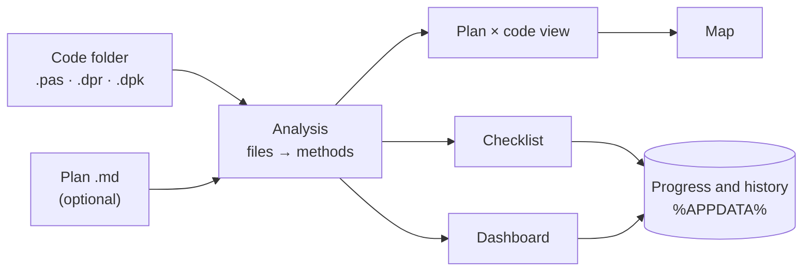

<div align="center">

# CodeManager

**Review, track and plan Delphi projects — folder by folder, file by file, method by method.**

[](LICENSE)
[](docs/DESENVOLVIMENTO.md)
[](docs/DESENVOLVIMENTO.md)
[](README.md)


</div>

CodeManager reads the units of a Delphi project and gives you a simple way to **see what you have**, **review what
has been looked at** and **follow progress over time** — without changing a single line of your code. If you have
a document describing what the project *should* contain, it compares the two.

> The application and most of the documentation are in **Portuguese**. This page is a short English summary.

## Features

- **Map** — the folder → file → method tree, with search, statistics and the **lines, complexity (cyclomatic and cognitive), parameters and nesting** of each method.
- **Checklist** — mark what you reviewed, what is under review or needs changes, what compiles, what passed Sonar, what is a priority; add notes. In a Git or Mercurial repository, or a Subversion working copy, it flags the files that changed since you reviewed them; SonarQube is optional and per user.
  A file is *done* when **all its methods** are reviewed.
- **Graph** — a visual map of the dependencies between units (from the `uses` clauses): levels, layer colours, coupling, **cycles**, and an HTML (SVG map) or Markdown report.
- **Code** — double-click a unit in the Graph, or a file or method in the Map or the Checklist, to read its code in a read-only tab (line numbers, Delphi syntax colouring, a modern font with ligatures; a method jumps to its line).
- **Dashboard** — numbers and charts for progress and code distribution, including day-by-day evolution, the most
  complex methods and the plan coverage.
- **Plan in Markdown** — write the intended structure (and code) in a `.md` file and see what is implemented,
  what is still missing (`PLANEADO`/planned) and what is extra (`EXTRA`). With no code folder, the document is
  analysed on its own, as if it were the code.
- **Follows your IDE** — re-analyses what you change as you save.
- **Exports** to Markdown, TXT, CSV, JSON, offline HTML pages and paper/PDF.
- **Safe saving** — progress is written atomically with a `.bak` copy and restored automatically if a file is damaged.
- **Four languages** — Portuguese, English, French and German (exported reports follow the language).
- **GitHub repositories** — analyse a repository instead of a folder: only the latest version is cloned into a private cache, read-only.
- **Appearance** — pick the accent colour (presets or any `#RRGGBB`, with contrast kept readable in both themes), the fonts, the text scale and the code size.
- **Light and dark themes.**


<sub>The evolution history in the screenshots is demo data; everything else is a real analysis of CodeManager's own source.</sub>

## Getting started

You need Windows 10/11 and, to build, **Delphi 13** with the **Chart4D** package (installed from GetIt).

```bat
git clone <repository-url>
cd CodeManager
build.bat
```

The executable is `out\bin\Win64\Release\CodeManager.exe` (a single file, no installer). Then, on the **Project**
page, name the project, pick its root folder and click **Analisar projeto** (*Analyse project*).

## How it works



The analysis engine does not depend on the UI or on Windows; the FireMonkey interface is drawn in code and follows
the theme. The application **only reads** the project it analyses. Your progress is stored in
`%APPDATA%\CodeManager`.

## Changes

What changed in **version 1.0.1** (the full history is in the [changelog](CHANGELOG.md), in Portuguese):

**New pages**
- **Graph** — a visual map of which unit uses which (from the `uses` clauses), with coupling, instability, cycles and an HTML or Markdown report.
- **Code** — read the source in tabs, opened by double-clicking in the Graph, the Map or the Checklist; Delphi syntax colouring, jump to the method and a modern font with ligatures.
- **Appearance** — accent colour, fonts, text scale and code size, just for you.
- **About** — version, build, environment, useful links and «Copy information» for issues.

**Improvements**
- **More metrics per method** — cognitive complexity, number of parameters and block nesting (on the Map, in the tooltip, CSV, JSON and the HTML pages).
- **SonarQube** — project and per-file measures (coverage, duplication, technical debt, A–E ratings), issue details and hotspots; shown in the Map, the Code page and the Dashboard.
- **Subversion** — «changed since review» also works in Subversion working copies (besides Git).
- **Languages** — Portuguese, English, French and German, including the exported HTML pages.
- **GitHub repositories** — analyse a repository instead of a folder (read-only).

**Behind the scenes**
- About 200 new automated tests (now over 710), including tests against a real Subversion repository.
- Fixed translation generator, updated documentation and images.

## Documentation (Portuguese)

- [User guide](docs/GUIA-DO-UTILIZADOR.md)
- [Plan format](docs/FORMATO-DO-PLANO.md)
- [Architecture](docs/ARQUITETURA.md)
- [Development](docs/DESENVOLVIMENTO.md)
- [Contributing](CONTRIBUTING.md) · [Changelog](CHANGELOG.md)

## License

[MIT](LICENSE). Charts use [Chart4D](https://github.com/GDKsoftware/Chart4D) (MIT) — see
[THIRD-PARTY-NOTICES.md](THIRD-PARTY-NOTICES.md).
