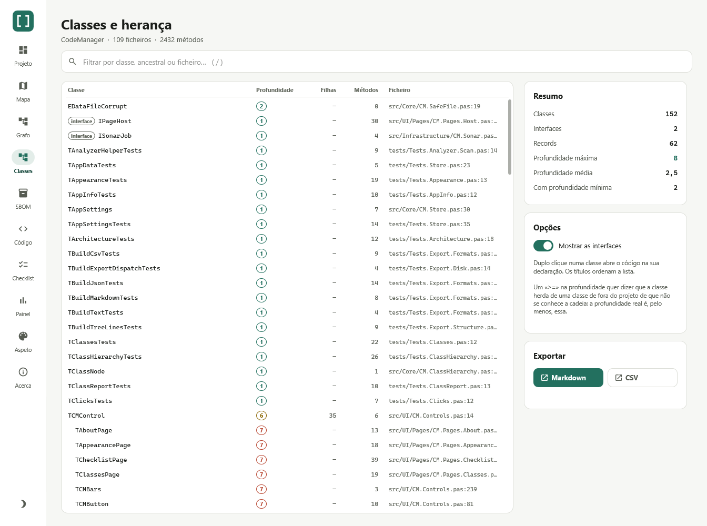
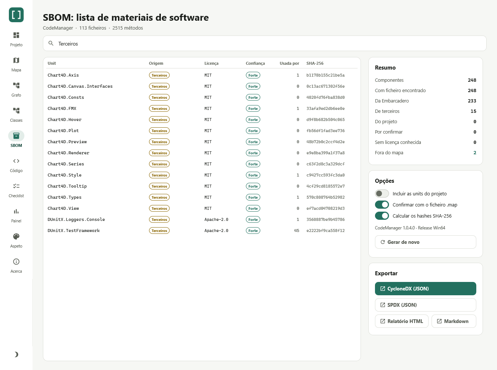
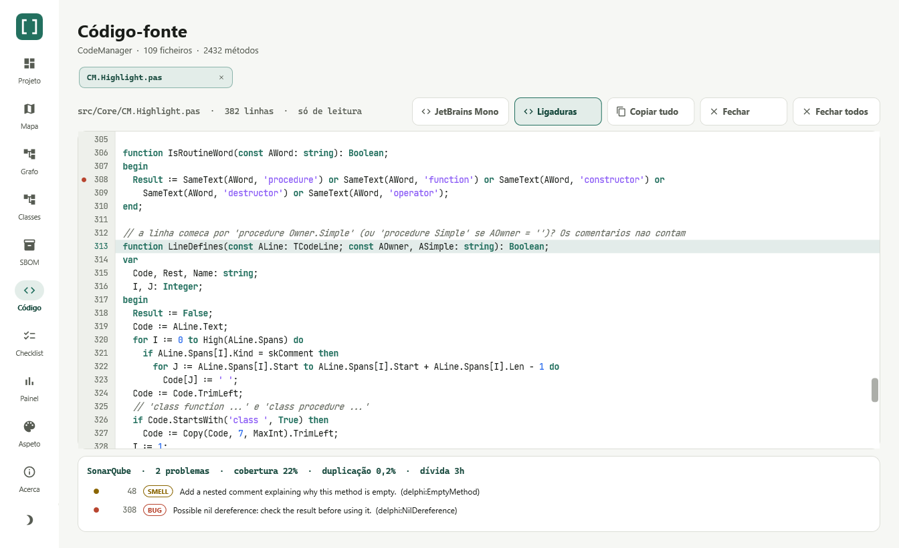
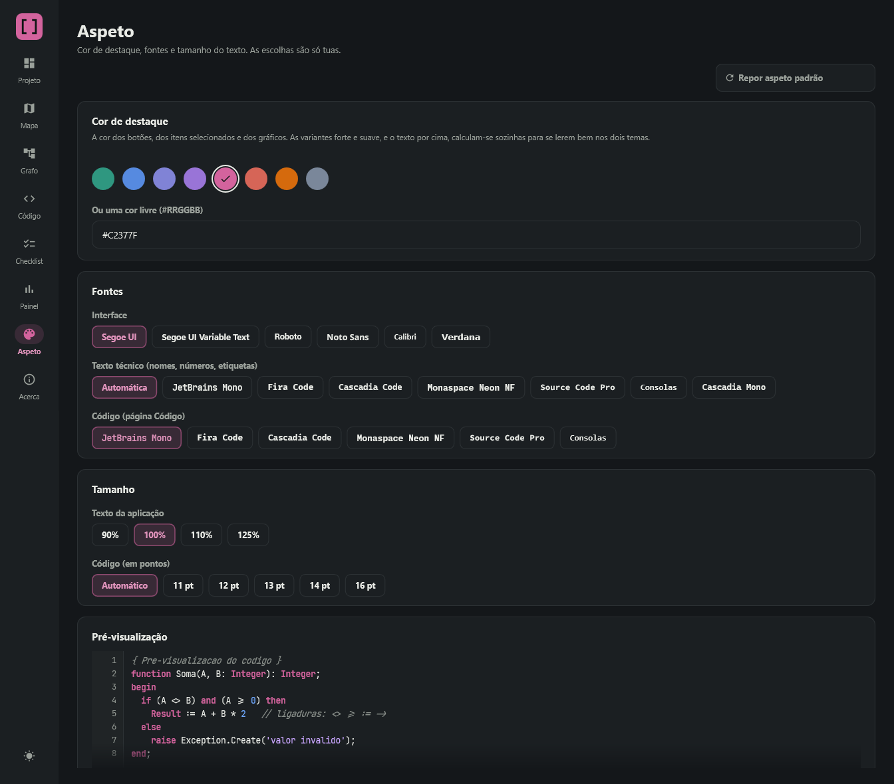
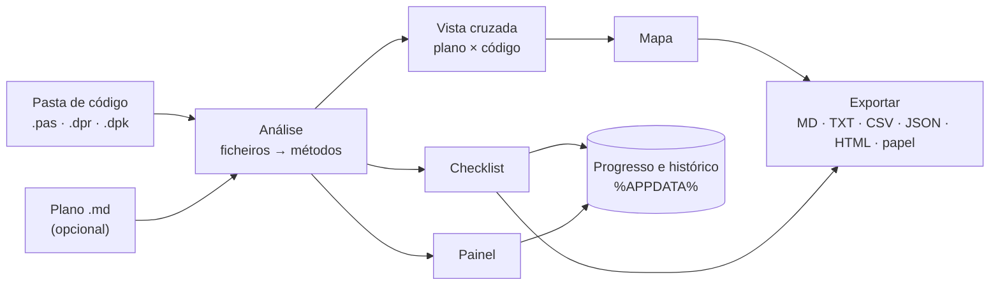

<div align="center">

# CodeManager

**Revê, acompanha e planeia projetos Delphi — pasta a pasta, ficheiro a ficheiro, método a método.**

[](LICENSE)
[](docs/DESENVOLVIMENTO.md#requisitos)
[](docs/DESENVOLVIMENTO.md#requisitos)
[](docs/ARQUITETURA.md#testes)
[](README.en.md)


</div>

O CodeManager lê as units de um projeto Delphi e dá-te uma forma simples de **ver o que tens**, **rever o que já
foi visto** e **acompanhar o progresso ao longo do tempo** — sem alterar uma linha do teu código. Se tiveres um
documento com o que o projeto *devia* ter, compara os dois.

- 🗺️ **Mapa** — a árvore pastas → ficheiros → métodos, com pesquisa, estatísticas e as **linhas, a complexidade (ciclomática e cognitiva), os parâmetros e o aninhamento** de cada método.
- ✅ **Checklist** — marca o que reviste, o que está em revisão ou precisa de alteração, o que compila, o que passou no Sonar, o que é prioritário; com notas.
- 🧬 **Classes** — as classes e interfaces do projeto com a **profundidade de herança** de cada uma, as filhas e a declaração, com exportação para Markdown e CSV.
- 🧾 **SBOM** — a lista de materiais de software do projeto (que units de fora usa, de onde vêm e com que confiança) em **CycloneDX** e **SPDX**, mais um relatório em quatro idiomas.
- 📊 **Painel** — números e gráficos do progresso e da distribuição do código, incluindo a evolução dia a dia.
- 📝 **Plano em Markdown** — escreve a estrutura prevista num `.md` e vê o que está implementado, o que falta e o que sobra.
- 👀 **Acompanha o IDE** — reanalisa sozinho o que mudas e grava.
- 📤 **Exporta** para Markdown, TXT, CSV, JSON, páginas HTML offline e papel/PDF.
- 🌗 **Tema claro e escuro.**

## Índice

- [Para quem é](#para-quem-é)
- [Começar](#começar)
- [O que podes fazer](#o-que-podes-fazer)
- [Plano × código](#plano--código)
- [Como funciona](#como-funciona)
- [Alterações](#alterações)
- [Documentação](#documentação)
- [Estado do projeto](#estado-do-projeto)
- [Contribuir](#contribuir)
- [Licença e créditos](#licença-e-créditos)

## Para quem é

- Quem faz **revisão de código** ou **auditoria** de um projeto Delphi grande e precisa de saber o que já foi visto.
- Quem **herdou ou migra** uma base de código e quer um mapa e uma lista de trabalho.
- Quem **planeia** a arquitetura antes de escrever (ou com a ajuda de um assistente de IA) e quer ver o código a
  aproximar-se do plano.
- Equipas que querem **acompanhar a qualidade**: compila, passou no Sonar, quantos métodos foram revistos.

## Começar

**Precisas de:** Windows 10/11 e, para compilar, **Delphi 13** com o pacote **Chart4D** (GetIt). Um executável
único, sem instalação.

```bat
git clone <url-do-repositório>
cd CodeManager
build.bat
```

O executável fica em `out\bin\Win64\Release\CodeManager.exe`. Passos detalhados, variáveis de ambiente e como correr
os testes em [docs/DESENVOLVIMENTO.md](docs/DESENVOLVIMENTO.md).

**Primeira utilização**

1. Abre o `CodeManager.exe`. Na página **Projeto**, dá um nome e escolhe a pasta raiz do teu projeto.
2. Carrega em **Analisar projeto**.
3. Explora no **Mapa**, revê na **Checklist**, vê o conjunto no **Painel**.

O guia completo, ecrã a ecrã, está em [docs/GUIA-DO-UTILIZADOR.md](docs/GUIA-DO-UTILIZADOR.md).

## O que podes fazer

### Ver o que tens

O **Mapa** mostra todas as pastas, ficheiros e métodos do projeto, com pesquisa (tecla `/`), estatísticas e as
caixas **C** (compila) e **S** (Sonar).


### Ver as dependências

O **Grafo** desenha quem usa quem, a partir das cláusulas `uses`: colunas por nível, cores por camada, acoplamento
(usa / usada por), **ciclos** assinalados e um relatório em HTML (com o mapa em SVG) ou Markdown.


### Classes e profundidade de herança

A página **Classes** lista as classes, interfaces e records que o projeto declara e a **profundidade de herança** de cada
classe (quantos níveis tem acima dela, com `TObject` a 0), as filhas diretas e os métodos. Um duplo clique abre o código
na declaração. Quando a cadeia passa por uma classe de fora que não se conhece, a profundidade vem com «>=». O Painel
mostra as classes mais profundas e a distribuição, e a página exporta Markdown e CSV.



### Lista de materiais de software (SBOM)

A página **SBOM** lista as units de fora que o projeto usa, de onde vem cada uma (Embarcadero ou terceiros) e com que
confiança, com o **SHA-256** de cada ficheiro e, nas bibliotecas de terceiros, a **versão e a licença** (do `boss.json`, do
`boss-lock.json`, do GetIt e do ficheiro de licença). Exporta **CycloneDX 1.5** e **SPDX 2.3** (JSON) e um relatório em HTML
(nos quatro idiomas) ou Markdown. Parte do código-fonte e do `.dproj`, sem compilar, e usa o ficheiro `.map` se existir.
Adapta ideias do [DX.Comply](https://github.com/omonien/DX.Comply).



### Ler o código

Um **duplo clique** numa unit do Grafo, ou num ficheiro ou método do Mapa e da Checklist, abre o código numa página
de **leitura** com separadores, números de linha, realce Delphi e uma fonte moderna com **ligaduras**; num método, salta
para a sua linha.


### Trazer o SonarQube para dentro do código

Com o SonarQube ligado (opcional e por utilizador), os problemas aparecem na margem das linhas do código, e o Mapa e o
Painel ganham as medidas do servidor: cobertura, duplicação, dívida técnica, classificações A–E e *hotspots*.



<sub>A imagem usa dados de demonstração do Sonar.</sub>

### Rever com método

A **Checklist** agrupa os ficheiros por pasta. Um ficheiro fica concluído quando **todos os métodos** estão revistos;
podes marcar prioridades ★, escrever notas, filtrar por camada e dar a cada método um **estado de revisão**
(por rever, em revisão, precisa de alteração, concluído). Num repositório **Git** ou **Mercurial**, ou numa cópia de trabalho **Subversion**, vês que ficheiros mudaram desde
a revisão e podes voltar a pô-los «por rever». Se quiseres, ligas o **SonarQube** (opcional, por utilizador)
para veres os problemas abertos por ficheiro. O progresso exporta-se em JSON, no mesmo formato
das páginas HTML offline.


### Acompanhar o progresso

O **Painel** reúne os números e os gráficos — evolução do progresso, progresso por camada, maiores units,
distribuição de métodos, Compila e Sonar — e segue o tema da aplicação.


<sub>O histórico da evolução nas imagens é de demonstração; o resto são dados reais da análise do próprio CodeManager.</sub>

### Aspeto à tua maneira

A página **Aspeto** muda a **cor de destaque** (cores prontas ou qualquer `#RRGGBB`, com contraste garantido nos dois
temas), as **fontes** da interface e do código, a **escala do texto** e o **tamanho do código**.



### Idiomas e repositórios do GitHub

A aplicação fala **português, inglês, francês e alemão** (muda-se na página Projeto, e os relatórios exportados
seguem o idioma). Em vez de uma pasta, podes analisar um **repositório do GitHub**: clona-se só a última versão para
uma cache própria, em modo só leitura.

### Tema claro e escuro

| Mapa | Checklist | Painel |
|---|---|---|
|  |  |  |

### Exportar

| Formato | Para quê |
|---|---|
| **Markdown / TXT** | Colar em documentação ou numa *issue*; o Markdown serve também de plano |
| **CSV** (separador `;`) | Abrir no Excel, em colunas |
| **JSON** | Integrar com outras ferramentas |
| **Páginas HTML offline** | Partilhar o mapa e a checklist interativa, sem instalar nada |
| **Papel / PDF** | Impressão com paginação e rodapé «Página X de N» |

## Plano × código

Escreve o que o projeto *deve* ter num documento Markdown — uma árvore, títulos com blocos de código, uma lista de
assinaturas, ou tudo misturado — e aponta o projeto para ele. Com pasta de código **e** plano, o Mapa compara-os:


| Etiqueta | Significa |
|---|---|
| `PLANEADO` | Está no plano e ainda não existe no código |
| `EXTRA` | Existe no código mas não está no plano |
| `MOVIDO` | Existe, mas noutra pasta |

Um plano mínimo, só com uma árvore:

````markdown
```text
src/
├── Core/
│   ├── CM.Analyzer.pas
│   └── CM.Plan.pas
└── UI/
    └── CM.MainForm.pas
```
````

Sem pasta de código, o documento é analisado sozinho — útil para rever o desenho antes de haver código. Todos os
estilos aceites, as regras de correspondência e um exemplo estão em [docs/FORMATO-DO-PLANO.md](docs/FORMATO-DO-PLANO.md).

## Como funciona



O motor de análise (`Core`) não depende de interface nem do Windows; a interface em FireMonkey é desenhada em
código e segue o tema. As camadas e as suas regras estão explicadas, com diagramas, em
[docs/ARQUITETURA.md](docs/ARQUITETURA.md).

Os teus dados ficam em `%APPDATA%\CodeManager` (`settings.json`, `progress-<id>.json`, `history-<id>.json`). A
aplicação **só lê** os ficheiros do projeto analisado.

## Alterações

O que mudou na **versão 1.0.4** (a lista completa, versão a versão, está no [registo de alterações](CHANGELOG.md)):

**Novidade**
- **Classes e herança** — nova página com as classes, interfaces e records do projeto e a **profundidade de herança** de cada uma, as filhas e os métodos. Ordena-se pelos títulos, filtra-se, e o duplo clique abre o código na declaração; quando a cadeia sai do projeto para uma classe desconhecida, a profundidade vem como mínimo («>=»). Exporta Markdown e CSV, e o Painel ganha as classes mais profundas e a distribuição da profundidade.

**Versão anterior (1.0.3)**
- **SBOM** — nova página com a **lista de materiais de software** do projeto: as units de fora que usa, de onde vem cada uma (Embarcadero ou terceiros), a confiança de cada uma e o **SHA-256** dos ficheiros. Parte do código-fonte e do `.dproj`, sem compilar, e usa o ficheiro `.map` se existir. Exporta **CycloneDX 1.5** e **SPDX 2.3** (JSON) e um relatório em HTML (quatro idiomas, com seletor na página) ou Markdown. Adapta ideias do [DX.Comply](https://github.com/omonien/DX.Comply) (MIT, Olaf Monien).

**Nos bastidores**
- Cerca de 60 testes novos (agora mais de 920), incluindo a extração das declarações de classes e o cálculo da hierarquia e da profundidade.
- Documentação e imagens atualizadas.

## Documentação

| Documento | Para quê |
|---|---|
| [Guia do utilizador](docs/GUIA-DO-UTILIZADOR.md) | Usar a aplicação, página a página |
| [Formato do plano](docs/FORMATO-DO-PLANO.md) | Escrever o documento de plano e perceber o cruzamento |
| [Arquitetura](docs/ARQUITETURA.md) | Camadas, modelo de dados, fluxos e decisões de desenho |
| [Desenvolvimento](docs/DESENVOLVIMENTO.md) | Compilar, testar, modo `--dev`, receitas para estender |
| [Contribuir](CONTRIBUTING.md) | Reportar erros, propor ideias, enviar código |
| [Registo de alterações](CHANGELOG.md) | O que mudou |

## Estado do projeto

Versão **1.0.4**. Em desenvolvimento ativo, desenvolvido e testado em **Windows / Win64** com **Delphi 13**. Mais de 920 testes
automáticos cobrem o motor, as exportações, o vigia e as regras de arquitetura; a interface é verificada com o
[modo de desenvolvimento](docs/DESENVOLVIMENTO.md#modo-de-desenvolvimento---dev).

Ideias para o futuro: mais métricas por classe (profundidade de herança). Sugestões são bem-vindas.

## Contribuir

Contribuições são bem-vindas — erros, ideias, documentação e código. Começa por [CONTRIBUTING.md](CONTRIBUTING.md).

## Licença e créditos

Distribuído sob a [licença MIT](LICENSE).

Os gráficos do Painel usam o [Chart4D](https://github.com/GDKsoftware/Chart4D) (MIT, GDK Software); os testes usam
o DUnitX. Ver [THIRD-PARTY-NOTICES.md](THIRD-PARTY-NOTICES.md).

<p align="center">
  <a href="https://www.buymeacoffee.com/joaofsferreira">
    
  </a>
</p>
