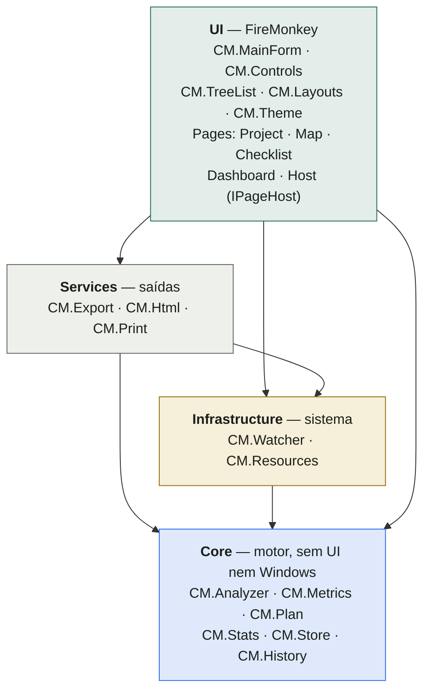
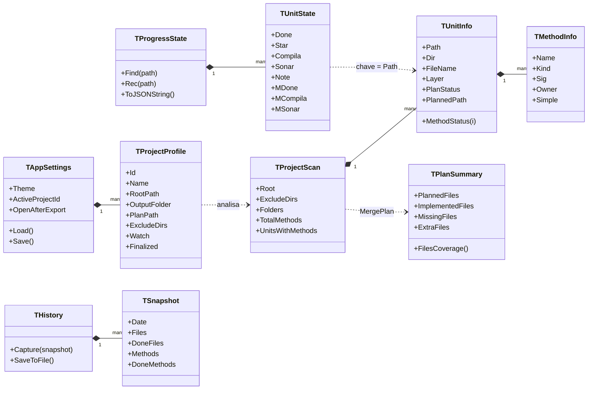
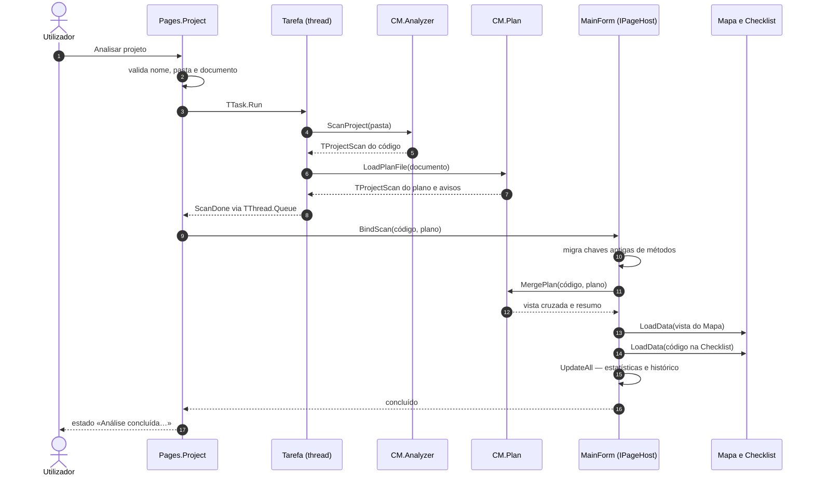
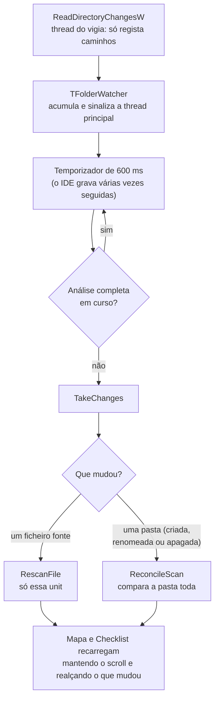
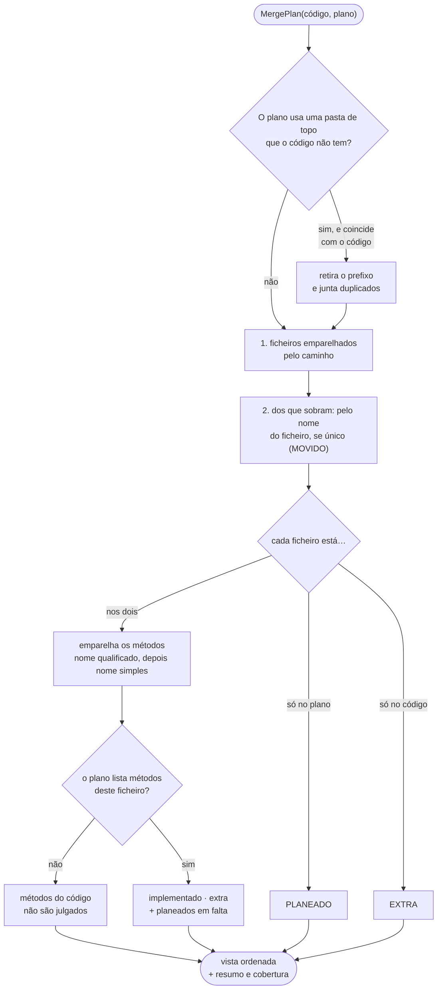
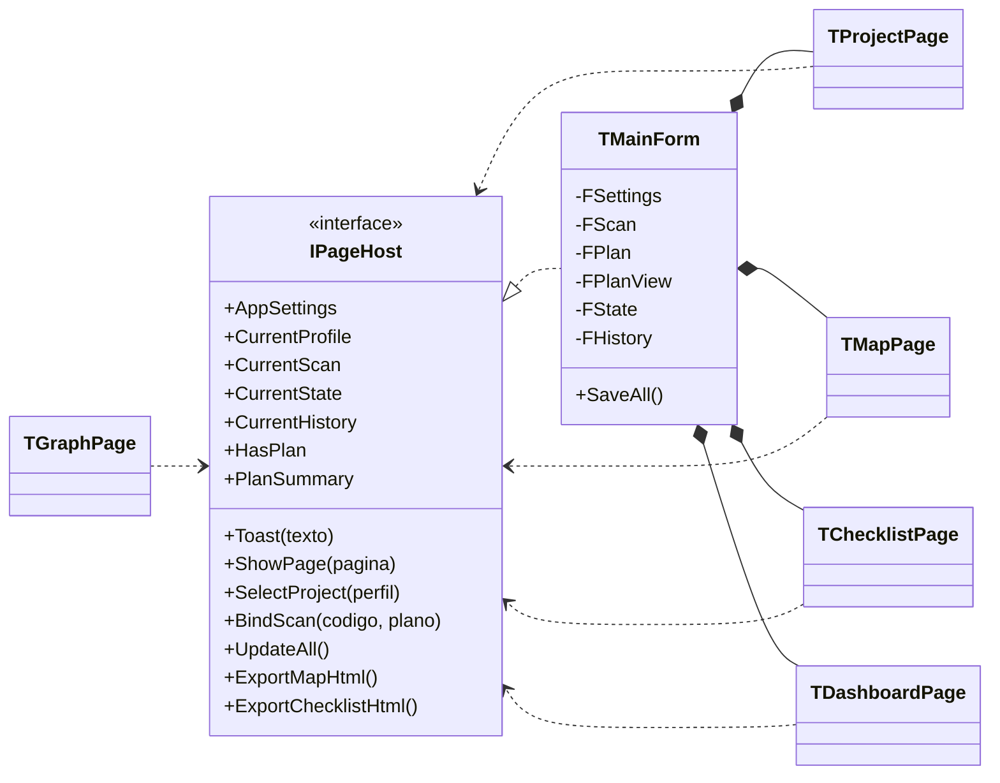
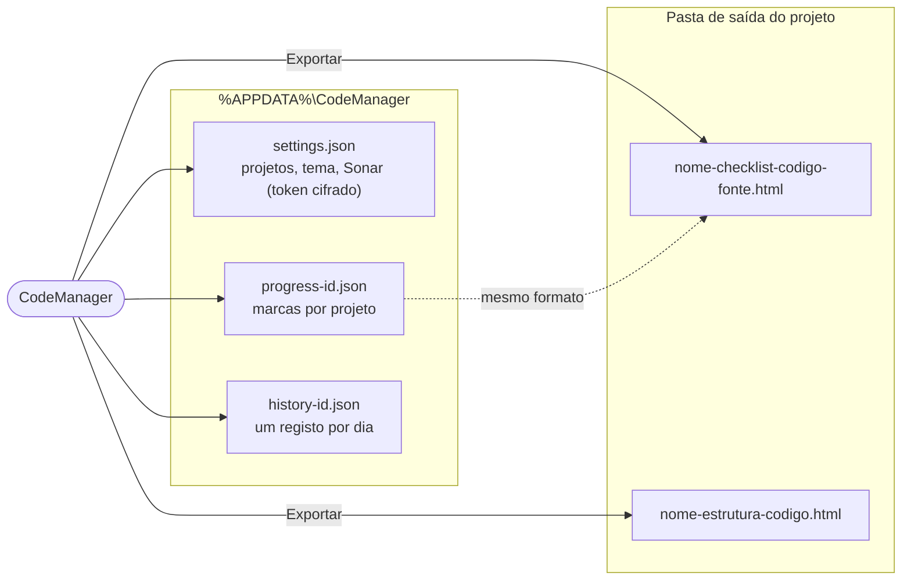

# Arquitetura

Este documento explica como o CodeManager está organizado por dentro: as camadas, o modelo de dados, o que
acontece quando se analisa um projeto e como o plano em Markdown é cruzado com o código. Os diagramas são
[Mermaid](https://mermaid.js.org/) e o GitHub desenha-os diretamente.

- [Visão geral](#visão-geral)
- [Camadas](#camadas)
- [Modelo de dados](#modelo-de-dados)
- [Analisar um projeto](#analisar-um-projeto)
- [Acompanhar alterações](#acompanhar-alterações)
- [Cruzamento plano × código](#cruzamento-plano--código)
- [Janela e páginas](#janela-e-páginas)
- [Onde ficam os dados](#onde-ficam-os-dados)
- [Threads](#threads)
- [Testes](#testes)
- [Decisões de desenho](#decisões-de-desenho)

## Visão geral

O CodeManager é uma aplicação **Delphi / FireMonkey** para Windows. A interface é desenhada em código (não há
`.fmx`) a partir de controlos próprios que se pintam com a paleta do tema, o que dá o mesmo aspeto em claro e escuro
e dispensa estilos externos.

Três ideias organizam o código:

1. **Camadas com dependências só para baixo.** O motor (`Core`) não sabe nada de janelas nem do Windows. A regra é
   verificada por um teste automático (`tests/Tests.Architecture.pas`), por isso não se degrada sem ninguém notar.
2. **Uma única representação da análise.** Uma pasta de código, um documento de plano e a vista que cruza os dois
   produzem todos um `TProjectScan` (ficheiros → métodos). O resto da aplicação não sabe de onde veio.
3. **A janela só coordena.** O estado partilhado (projeto ativo, análise, progresso) vive na janela principal;
   cada página fala com ela por uma interface (`IPageHost`) e é responsável apenas pelo seu ecrã.

## Camadas

| Camada | Units | Responsabilidade |
|---|---|---|
| **Core** | `CM.Analyzer`, `CM.Metrics`, `CM.Plan`, `CM.Stats`, `CM.Store`, `CM.History`, `CM.SafeFile`, `CM.SonarModel` | Analisar código e planos, calcular estatísticas, guardar/ler JSON. **Só usa a RTL** (`System.*`): nada de `FMX.*`, `Vcl.*` ou `Winapi.*`. |
| **Infrastructure** | `CM.Watcher`, `CM.Resources`, `CM.Git`, `CM.Secrets`, `CM.Sonar` | Tudo o que toca no sistema operativo ou na rede: `ReadDirectoryChangesW` numa thread, leitura de recursos embutidos, a execução (só leitura) do `git`, a cifra do token (DPAPI) e o cliente HTTP do SonarQube. |
| **Services** | `CM.Export`, `CM.Html`, `CM.Print`, `CM.GitReview` | Produzem ficheiros e papel a partir de uma análise: Markdown, TXT, CSV, JSON, páginas HTML offline e impressão. |
| **UI** | `CM.MainForm`, `CM.Controls`, `CM.TreeList`, `CM.Layouts`, `CM.Theme` e `Pages\*` | Janela, controlos pintados e páginas. |

A regra de dependência é: `Core` não importa ninguém; `Infrastructure` importa `Core`; `Services` importa `Core` e
`Infrastructure`; `UI` pode importar tudo. O teste de arquitetura lê as cláusulas `uses` de cada ficheiro de `src\`
e falha se `Core` importar outra camada ou `FMX`/`Vcl`/`Winapi`, se `Infrastructure` importar `Services` ou `UI`,
se `Services` importar `UI`, ou se existir um `.pas` fora das quatro pastas.

## Modelo de dados

Pontos a reter:

- **`TProjectScan` é só leitura depois de criado**: representa o código (ou o plano) tal como foi analisado.
  O progresso **não** vive nele. Vive em `TProgressState`, indexado pelo caminho da unit (`src/Core/CM.Store.pas`) e
  pelo nome qualificado do método (`TFoo.Bar`, ou `TFoo.Bar(Integer)` num overload). Assim, voltar a analisar não
  perde marcas.
- **Os estados de revisão** (`TReviewState`: por rever, em revisão, precisa de alteração, concluído) vivem em
  `CM.Stats`, que decide o estado efetivo de um método (`ReviewOfMethod`), de um ficheiro (`ReviewOfUnit`, derivado
  dos métodos) e a transição (`NextReview`, `SetMethodReview`). No progresso, «concluído» é a marca de sempre
  (`done`, `m`); os outros dois ficam em campos opcionais (`wip`/`fix` e `mw`/`mf`), por isso o formato partilhado
  com as páginas HTML não muda para quem não os usa.
- **O estado face ao plano** (`PlanStatus`, `MethodStatus`) só existe na *vista cruzada* que o Mapa mostra, nunca na
  análise do código. A vista é uma cópia das units; a análise original não é alterada.
- **As medidas dos métodos** (`Lines`, `Complexity`) vêm de `CM.Metrics`, que percorre os corpos da secção
  `implementation` (já sem comentários nem textos, mas com as mudanças de linha) e o `CM.Analyzer` associa ao método
  pelo cabeçalho. Zero significa «sem corpo medido». Como entram na comparação de `RescanFile`, editar só o corpo de
  um método atualiza as medidas.
- **A revisão e o Git.** Cada ficheiro guarda o commit da última revisão (`TUnitState.Rev`, campo opcional `rc`).
  `CM.Git` (Infrastructure) corre o `git` sem janela e só lê; `CM.GitReview` (Services) compara os commits guardados
  com `git diff --name-only --relative <commit>` (uma consulta por commit, não por ficheiro) e devolve os ficheiros
  revistos que mudaram. As regras puras (`StaleReviews`, `ResetReview`, `BackfillRevisions`, `CommitAt`) estão no
  Core e testam-se sem Git; `Tests.Git` usa um repositório temporário real. `Tests.Sonar` cobre o modelo, os analisadores, a cifra do token e as definições sem precisar de um servidor.
- **O SonarQube é opcional e por utilizador.** `TAppSettings` guarda o interruptor, o endereço e o token (cifrado
  por `CM.Secrets` com o DPAPI e uma mistura própria da aplicação, por isso só se decifra na mesma conta e
  computador); cada `TProjectProfile` guarda a sua chave (`sonarKey`), e sem chave o projeto não usa o Sonar. Os campos
  só entram no `settings.json` quando usados. `CM.Sonar` (Infrastructure) faz GET autenticado (Basic com o token) a
  `measures/component_tree`, `issues/search` e `qualitygates/project_status` e preenche um `TSonarSnapshot` do Core;
  os analisadores das respostas são puros e testam-se com textos de exemplo. As consultas correm numa thread
  (`ISonarJob`) que **nunca toca na janela**: a janela consulta `Done` num temporizador e a thread guarda a sua
  própria referência, por isso fechar a janela a meio é seguro. O token nunca vai para URLs, logs nem ficheiros
  do repositório.
- **O histórico** guarda um `TSnapshot` por dia (o último do dia substitui o anterior).

## Analisar um projeto

O que acontece quando se carrega em **Analisar projeto** (ou quando se abre um projeto que já tem pasta):

Notas:

- Cada análise tem um **token**. Se o utilizador mudar de projeto a meio, o resultado que chegar depois é descartado
  (e libertado) em vez de ser aplicado ao projeto errado.
- O documento do plano é **opcional e tolerante a falhas**: se não existir ou não puder ser lido, a análise do código
  segue e aparece um aviso. Sem pasta de código, o plano passa a ser a própria análise («só plano»).
- O progresso antigo, que identificava os métodos só pelo nome, é migrado para o nome qualificado (`MigrateMethodKeys`).

## Acompanhar alterações

Com «Acompanhar alterações na pasta do projeto» ligado, a aplicação reanalisa só o que mudou:

A thread do vigia **não lê nem analisa ficheiros**: só regista caminhos. A análise corre na thread principal, porque
usa expressões regulares partilhadas que não são seguras entre threads — é por isso que, enquanto uma análise
completa corre noutra thread, o vigia espera.

## Cruzamento plano × código

`MergePlan` recebe a análise do código e a do plano e devolve uma **vista** com o estado de cada ficheiro e método:

Regras que convém conhecer:

- Um **método extra** só é contado em ficheiros que existem nos dois lados. Os métodos de um ficheiro `EXTRA` não
  entram na contagem.
- Se o plano lista um ficheiro **sem métodos** (por exemplo, só numa árvore), os métodos do código **não** são
  julgados — o plano não diz nada sobre eles.
- Dois métodos com o mesmo nome simples de um dos lados **nunca são adivinhados**: ficam como não emparelhados.
- A cobertura é `implementado / planeado`: não penaliza o que o plano não prevê.

A leitura do documento está descrita em [FORMATO-DO-PLANO.md](FORMATO-DO-PLANO.md).

## Janela e páginas

`TMainForm` guarda o estado que atravessa as páginas e implementa `IPageHost`. Cada página recebe a interface no
construtor e nunca conhece a janela concreta.

| Página | Faz |
|---|---|
| `Pages.Project` | Lista e configura projetos, lança a análise (numa thread), liga o vigia, exporta as páginas HTML. |
| `Pages.Map` | Árvore pastas → ficheiros → métodos, estatísticas (e cobertura do plano), exportar/imprimir a estrutura. |
| `Pages.Checklist` | Conclusão por ficheiro e método, prioridade, notas, filtros por camada, cobertura do plano, importar/exportar progresso. |
| `Pages.Graph` | Mapa de dependências entre units (`Core.Deps` + `UI.GraphView`), resumo, ciclos, detalhes e relatório HTML/Markdown (`Services.DepsReport`). O grafo calcula-se em segundo plano. |
| `Pages.Code` | Leitura do código em separadores (`UI.CodeView` desenha; `Core.Highlight` parte em linhas, realça a sintaxe e encontra a linha de um método). Abre-se por duplo clique (`UI.Clicks`) no Grafo, no Mapa e na Checklist, via `IPageHost.OpenCode`. |
| `Core.SonarModel` / `Infrastructure.Sonar` | O retrato do Sonar (por ficheiro: problemas, medidas, hotspots; do projeto: medidas e classificações) e o cliente de leitura da API; os analisadores das respostas são puros. Alimentam o Mapa, a Checklist, a página Código e o Painel. |
| `Infrastructure.Vcs` / `Git` / `Svn` / `Hg` | `Vcs` descobre se a pasta é Git, Subversion ou Mercurial (o marcador `.git` / `.svn` / `.hg` mais próximo) e despacha para o cliente; `Proc` corre os programas sem janela. Só leitura. `Services.GitReview` usa só `Vcs`. |
| `Pages.Appearance` / `Theme` / `Core.Colors` | A página Aspeto (cor de destaque, fontes, escala). `Theme` guarda o aspeto (`ApplyAppearance`), deriva as paletas e aplica a escala do texto em `DrawTextRect` / `MeasureText`; `Core.Colors` é a matemática de cor (hex, HSL, contraste, `DeriveAccent`), sem interface. |
| `Pages.About` / `Core.AppInfo` / `Infrastructure.SysInfo` | A página Acerca. `AppInfo` (puro) lê e compara versões, nomeia o Delphi e monta o texto de diagnóstico; `SysInfo` lê o executável (versão e data), a compilação e o Windows. A versão mostrada é a do recurso de versão do executável (`VerInfo_Keys` no `CodeManager.dproj`). |
| `Pages.Dashboard` | Cartões de números e gráficos [Chart4D](https://github.com/GDKsoftware/Chart4D) que seguem o tema; com plano, uma linha de cobertura. |

O que cada página **não** faz (por exemplo, trocar de projeto) pede-o ao anfitrião. Quando uma ação mexe em várias
páginas, é o anfitrião que as coordena: `BindScan` recarrega o Mapa e a Checklist, atualiza as estatísticas e
regista o dia no histórico.

## Onde ficam os dados

| Ficheiro | Conteúdo |
|---|---|
| `settings.json` | Projetos (nome, pasta, saída, plano, exclusões, vigia, finalizado), tema, abrir página após exportar. |
| `progress-<id>.json` | Por unit: concluída, prioridade, Compila, Sonar, nota e os conjuntos de métodos revistos/Compila/Sonar. É o **mesmo formato** das páginas HTML, por isso exportar/importar funciona nos dois sentidos. |
| `history-<id>.json` | Lista de registos diários: total e concluído de ficheiros e métodos, Compila e Sonar. Fica à parte do progresso para não alterar o formato partilhado com o HTML. |

Apagar um projeto da lista apaga também o seu `progress-<id>.json` e `history-<id>.json`. Os ficheiros do projeto
analisado nunca são tocados.

## Threads

| Thread | O que faz | Como comunica |
|---|---|---|
| Principal (UI) | Tudo o que mexe em controlos; reanálise de ficheiros pelo vigia. | — |
| Tarefa de análise (`TTask`) | `ScanProject` e `LoadPlanFile`. | `TThread.Queue` para progresso e resultado; o token descarta resultados antigos. |
| Vigia (`TFolderWatcher`) | `ReadDirectoryChangesW`; só regista caminhos. | Sinaliza a thread principal com `TThread.Queue`. |

## Testes

Os testes são [DUnitX](https://github.com/VSoftTechnologies/DUnitX) (já vêm com o Delphi) e correm em consola.

| Área | Ficheiros | Cobre |
|---|---|---|
| Análise | `Tests.Analyzer.*`, `Tests.Metrics` | Extração de métodos (comentários, strings, genéricos, overloads, tipos aninhados, codificações), `ScanProject`, `RescanFile`, `ReconcileScan`; linhas e complexidade dos corpos. |
| Estatísticas e dados | `Tests.Stats`, `Tests.Store`, `Tests.History`, `Tests.Review` | Regras de conclusão, JSON de definições e progresso (incluindo o formato das páginas HTML), histórico diário. |
| Saídas | `Tests.Export.*`, `Tests.Print.*`, `Tests.Html` | Cada formato de exportação, paginação da impressão, páginas HTML. |
| Sistema | `Tests.Watcher` | O vigia numa pasta temporária. |
| Plano | `Tests.Plan` | Leitura do documento (todos os estilos, casos limite) e cruzamento. |
| Arquitetura | `Tests.Architecture` | As regras entre camadas. |

A interface não tem testes automáticos; é verificada com o modo de desenvolvimento descrito em
[DESENVOLVIMENTO.md](DESENVOLVIMENTO.md), que também gera as imagens desta documentação.

## Decisões de desenho

- **Controlos pintados em vez de estilos FMX.** Dão controlo total sobre o aspeto e o tema (claro/escuro, barra de
  título incluída) sem folhas de estilo.
- **Estado do plano num array paralelo (`MethodPlan`)** em vez de um campo novo no record `TMethodInfo`: os
  `TMethodInfo` são criados campo a campo em vários sítios e um campo novo herdaria lixo.
- **«Concluído» não passou a ser um valor do estado de revisão guardado.** Continua a ser `done`/`m`, que as páginas
  HTML e as estatísticas já usam; o estado de revisão completo calcula-se por cima (`ReviewOfMethod`).
- **Histórico num ficheiro próprio.** O formato do progresso é partilhado com as páginas HTML offline; misturar
  histórico nele quebraria a compatibilidade.
- **Leitor de planos tolerante, cruzamento conservador.** O leitor aceita vários estilos (quem escreve planos não
  deveria ter de aprender um formato); o cruzamento, em contrapartida, nunca adivinha quando há ambiguidade.
- **Chart4D compilado no executável**, a partir do código-fonte, sem pacotes nem BPL em tempo de execução.
