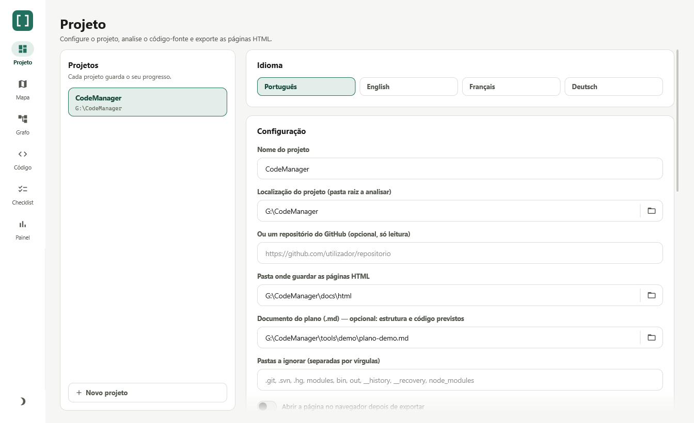
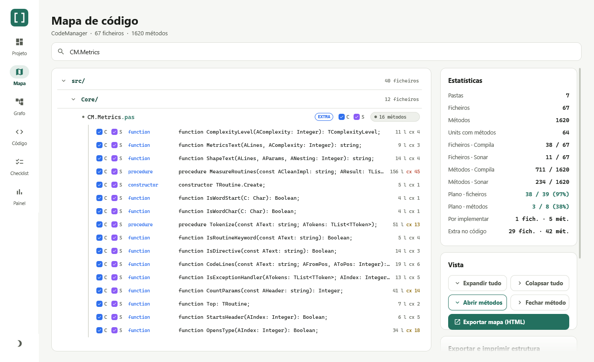
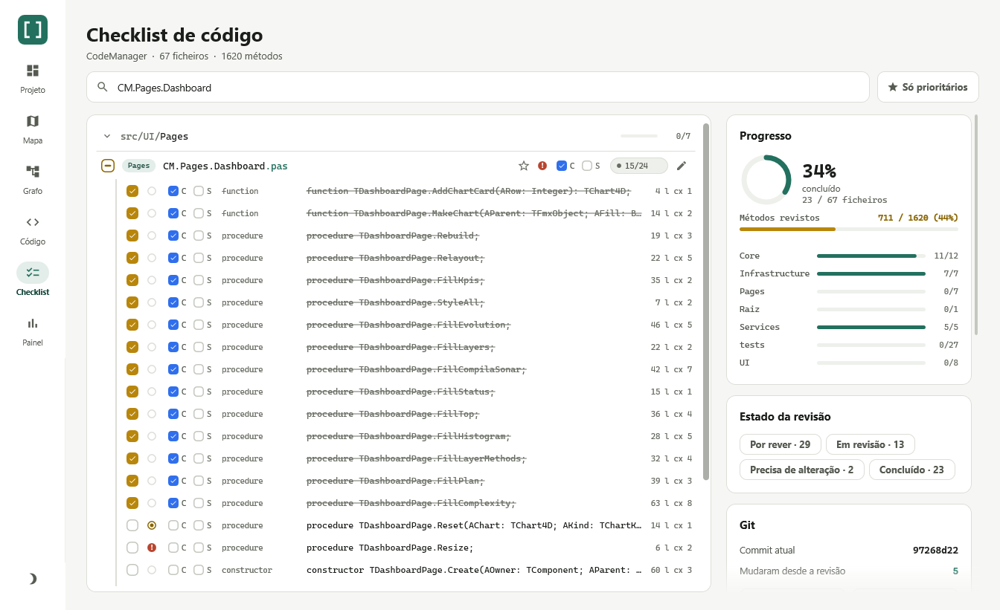
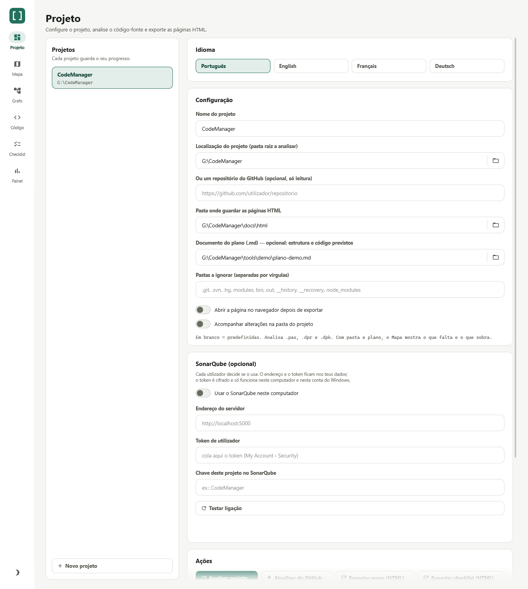
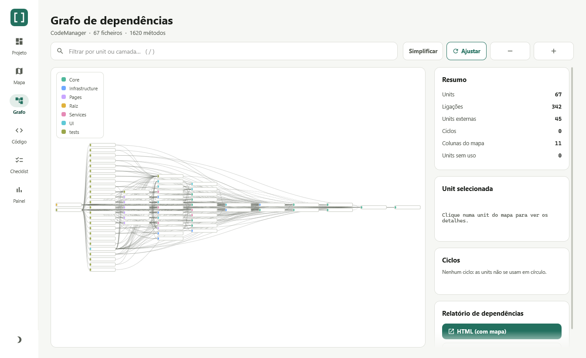
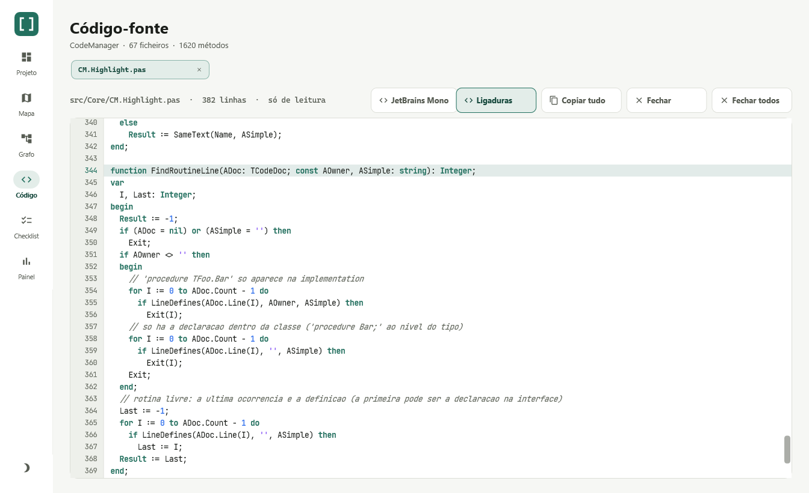
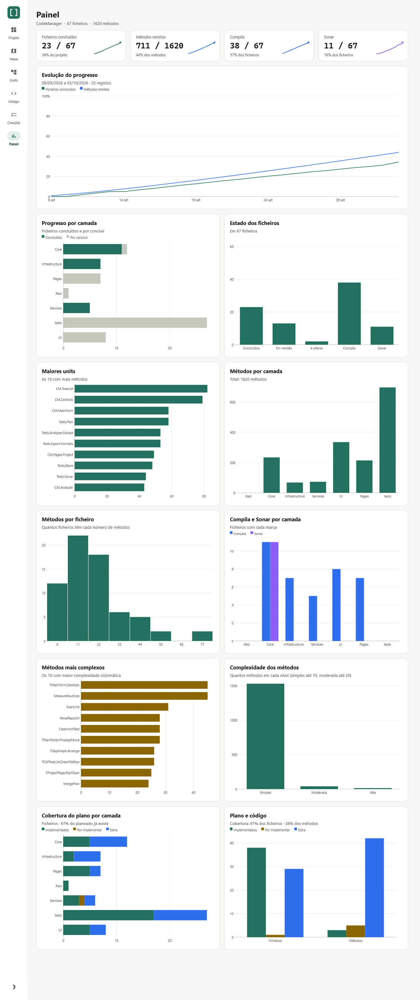

# Guia do utilizador

Este guia percorre a aplicação ecrã a ecrã. As imagens mostram o CodeManager a analisar o seu próprio código-fonte
(o histórico da evolução é de demonstração).

- [Para que serve](#para-que-serve)
- [Primeiros passos](#primeiros-passos)
- [Projeto](#projeto)
- [Mapa](#mapa)
- [Checklist](#checklist)
- [Painel](#painel)
- [Plano (documento .md)](#plano-documento-md)
- [Exportar e imprimir](#exportar-e-imprimir)
- [Tema claro e escuro](#tema-claro-e-escuro)
- [Atalhos e pequenos truques](#atalhos-e-pequenos-truques)
- [Onde ficam os dados](#onde-ficam-os-dados)
- [Resolução de problemas](#resolução-de-problemas)

## Para que serve

O CodeManager ajuda a **rever e acompanhar um projeto Delphi**. Lê as units (`.pas`), os programas (`.dpr`) e os
pacotes (`.dpk`) de uma pasta e mostra-te:

- a **estrutura**: pastas → ficheiros → métodos (o **Mapa**);
- uma **checklist de revisão**: marcar o que já reviste, o que compila, o que passou no Sonar, o que é prioritário;
- um **painel** com o progresso e a distribuição do código, incluindo a evolução ao longo dos dias;
- opcionalmente, um **plano em Markdown** com o que o projeto *deveria* ter, para ver o que falta e o que sobra.

Nada do que fazes altera os ficheiros do teu projeto: a aplicação só os lê.

## Primeiros passos

1. Abre a aplicação. Na página **Projeto**, dá um nome ao projeto e escolhe a **pasta raiz** (o botão da pasta
   ao lado do campo abre o seletor).
2. Carrega em **Analisar projeto**. A barra mostra o avanço e, no fim, o resumo («Análise concluída: …»).
3. Vai ao **Mapa** para explorar, à **Checklist** para rever e ao **Painel** para ver o conjunto.

O progresso grava-se sozinho (cerca de meio segundo depois de cada alteração). Podes ter **vários projetos**,
cada um com o seu progresso.

## Projeto

É aqui que configuras e analisas.

| Campo / botão | Para que serve |
|---|---|
| **Projetos** (lista à esquerda) | Os teus projetos. Clica num para o abrir; **Novo projeto** cria outro. |
| **Nome do projeto** | Aparece nos títulos, nos ficheiros exportados e na lista. |
| **Localização do projeto** | A pasta raiz a analisar (inclui subpastas). |
| **Pasta onde guardar as páginas HTML** | Destino do «Exportar mapa/checklist (HTML)». |
| **Ou um repositório do GitHub** | Opcional, só leitura. Ver [Repositório do GitHub](#repositório-do-github). |
| **Documento do plano (.md)** | Opcional. Ver [Plano](#plano-documento-md). |
| **Pastas a ignorar** | Nomes de pastas separados por vírgulas. Em branco usa as predefinidas: `.git`, `.svn`, `.hg`, `modules`, `bin`, `out`, `__history`, `__recovery`, `node_modules`. |
| **Abrir a página no navegador depois de exportar** | Abre o HTML assim que é gerado. |
| **Acompanhar alterações na pasta do projeto** | Reanálise automática quando gravas ficheiros. Ver [abaixo](#acompanhar-alterações). |
| **Atualizar do GitHub** | Volta a obter a última versão do repositório e reanalisa. |
| **Analisar projeto** | Lê a pasta (e o plano, se houver). Corre em segundo plano. |
| **Exportar mapa / checklist (HTML)** | Gera as páginas offline. |
| **Fechar projeto como finalizado** | Marca o projeto como terminado: aparece um selo na janela e no mapa exportado. Volta a abrir com **Reabrir projeto**. |
| **Remover projeto** | Tira-o da lista e apaga o progresso e o histórico guardados. Os ficheiros do projeto não são tocados. |

Enquanto o projeto não tem análise, a lista mostra os **Primeiros passos**.

### Idioma

O cartão **Idioma**, no topo da página, muda a aplicação entre **Português**, **English**, **Français** e
**Deutsch**; a interface reconstrói-se logo, e os relatórios exportados (Markdown, CSV, relatório de dependências e as páginas HTML do mapa e da checklist) passam a seguir o idioma escolhido. Na
primeira execução usa o idioma do Windows (português, francês ou alemão; qualquer outro usa o inglês).

### Repositório do GitHub

Em vez de uma pasta, podes indicar um repositório do GitHub (`https://github.com/dono/repo`, `dono/repo`,
`git@github.com:dono/repo` ou um endereço `…/tree/ramo/pasta`). O CodeManager clona só a **última versão**
(`--depth 1`) para uma cache própria em `%APPDATA%\CodeManager
epos` e analisa-a como qualquer outra pasta. Só
clona de `github.com`, **nunca escreve** no repositório remoto nem nas tuas pastas, e a cache é apagada quando
removes o projeto. **Atualizar do GitHub** traz a versão mais recente. Precisas do Git instalado.

### Acompanhar alterações

Liga **Acompanhar alterações na pasta do projeto** e deixa o CodeManager aberto enquanto trabalhas no IDE. Quando
gravas, crias, apagas ou mudas o nome a uma unit (ou a uma pasta), a aplicação volta a analisar **só o que mudou** e
atualiza o Mapa, a Checklist e as estatísticas sem perderes o scroll nem as pastas abertas. Os ficheiros e métodos
novos ou alterados ficam realçados durante alguns segundos.

> Vê o que está **gravado em disco**, não o texto por gravar no editor. Se alterares o documento do plano, é preciso
> voltar a carregar em **Analisar projeto**.

## Mapa

A árvore do projeto: **pastas → ficheiros → métodos**.

- **Pesquisa** no topo (atalho: tecla `/`): filtra por pasta, ficheiro ou método.
- Clica no **pill** com o número de métodos (`35 métodos`) para abrir ou fechar os métodos de um ficheiro. Os botões
  **Expandir tudo**, **Colapsar tudo**, **Abrir métodos** e **Fechar métodos** fazem-no de uma vez.
- As caixas **C** (*Compila*) e **S** (*Sonar*) assinalam, por ficheiro ou por método, que compila sem erros e que
  passou na análise do SonarQube.
- À direita de cada método vês as **linhas de código** (`74 l`) e a **complexidade ciclomática** (`cx 18`); a dica
  mostra-as por extenso. Ver [Linhas e complexidade](#linhas-e-complexidade-dos-métodos).
- Passa o rato por cima de um nome ou assinatura cortado com «…» para ver o texto completo.
- A coluna da direita mostra as **estatísticas** (e a cobertura do plano, se houver) e as ações de **exportar e
  imprimir** a estrutura.

### Linhas e complexidade dos métodos

Cada método com corpo mostra duas medidas, calculadas só a partir do código (nada é compilado):

| Medida | O que conta |
|---|---|
| **Linhas** (`l`) | As linhas com código, do cabeçalho ao `end` final. Não conta linhas em branco nem de comentários; inclui as rotinas aninhadas. |
| **Complexidade** (`cx`) | Complexidade ciclomática: 1 + o número de decisões do próprio corpo (`if`, `while`, `for`, `repeat`, `case`, handlers `on … do`, `and`, `or`). Os métodos anónimos contam para a rotina que os contém; as rotinas aninhadas têm a sua própria. |

A cor da complexidade avisa: **até 10** é simples (cinzento), **11 a 20** é moderada (âmbar) e **mais de 20** é alta
(vermelho). Métodos só declarados na interface, `forward` ou `external` não têm medida.

A dica de cada método mostra ainda duas medidas de forma:

- **Parâmetros:** quantos nomes o cabeçalho declara (`A, B: Integer; var C: string` são 3). Muitos parâmetros
  costumam pedir um registo ou um objeto.
- **Aninhamento:** o máximo de blocos abertos dentro do corpo (`begin`, `try`, `case`, `repeat`, `asm`), sem contar o
  próprio corpo. Um corpo sem blocos interiores tem 0; um `if … then begin` tem 1; um `try` com um `case` lá dentro
  e tudo dentro desse `if`, 3. Não conta um `if` sem `begin`.

O CSV e o JSON exportados levam estas duas medidas (colunas **Parâmetros** e **Aninhamento**; `parameters` e
`nesting` no JSON).

## Checklist

A página de revisão: ficheiros agrupados por pasta, com o progresso à vista.

| Elemento | O que faz |
|---|---|
| Caixa à esquerda do ficheiro | **Concluído.** Num ficheiro com métodos é *automática*: fica concluído quando **todos** os métodos estiverem marcados (a caixa com um traço significa «por concluir»). Num ficheiro sem métodos, marcas tu. |
| Pontinho de estado | O **estado da revisão** (ver abaixo). Clica para mudar de estado. |
| Etiqueta | A **camada** (a pasta imediata). |
| ★ | **Prioridade.** O botão **Só prioritários** filtra por elas. |
| **C** / **S** | Compila / Sonar. |
| `41/41` | Métodos revistos / total. Clica para abrir os métodos e marcá-los um a um. |
| ✎ | **Nota** sobre o ficheiro (grava-se à medida que escreves). |

À direita:

- **Progresso:** o anel dos ficheiros concluídos, a barra dos métodos revistos e uma barra por camada.
- **Estado da revisão:** os quatro estados, cada um com o número de ficheiros; clica para filtrar (podes juntar vários).
- **Git:** num repositório, o commit atual e quantos ficheiros revistos mudaram desde a revisão (ver abaixo).
- **SonarQube:** só se o ativaste (ver abaixo): a *quality gate*, os problemas abertos e **Sincronizar S**.
- **Filtrar por camada:** clica nas camadas para ver só essas.
- **Ações:** expandir/colapsar, **Markdown** (copia a checklist para a área de transferência), **Exportar HTML**,
  **Exportar/Importar** o progresso (`.json`) e **Reiniciar progresso**.

O ficheiro de progresso exportado tem o mesmo formato das páginas HTML, por isso podes levar o progresso de uma
para a outra.

### Estados de revisão

Além de «concluído», cada método (e cada ficheiro sem métodos) pode estar noutros estados. Clica no **pontinho** à
esquerda para passar ao seguinte; a caixa continua a marcar «concluído».

| Pontinho | Estado | Quando usar |
|---|---|---|
| Anel cinzento | **Por rever** | Ainda não foi visto. |
| Anel com miolo âmbar | **Em revisão** | Estás a ver, ou ficou a meio. |
| Círculo vermelho com `!` | **Precisa de alteração** | Revisto, mas há algo a corrigir. |
| (a caixa marcada) | **Concluído** | Revisto e aceite. |

- Os estados são exclusivos: marcar «concluído» limpa os outros, e clicar no pontinho de um método concluído
  **reabre-o** como «precisa de alteração».
- O estado de um **ficheiro com métodos** vem deles: *concluído* se todos o estão, *precisa de alteração* se algum
  precisa, *em revisão* se algum está ou já há parte feita, e *por rever* caso contrário.
- Com um filtro de estado ativo, a lista mostra só os ficheiros e métodos nesses estados.
- O **Markdown** copiado e as exportações com estado marcam `[Em revisão]` e `[Precisa de alteração]` a seguir à
  caixa; o CSV tem a coluna **Revisão** e o JSON o campo `review` (`pending`, `inReview`, `needsChange`, `done`).
- As **páginas HTML offline** continuam a conhecer só o «concluído»: mostram o resto como por concluir, mas não o
  perdem ao exportar o progresso.

### Alterações desde a revisão (Git)

Se a pasta do projeto está num repositório **Git** (e o `git` está no `PATH`), a Checklist avisa quando um ficheiro
que já revistes mudou depois disso:

- Cada ficheiro guarda o **commit** em que o revistes (muda sempre que alteras o seu estado). Os ficheiros revistos
  antes desta funcionalidade ganham o commit que era o atual na hora em que os concluístes.
- Um ficheiro revisto cujo conteúdo é diferente desse commit — seja por commits novos ou por alterações ainda por
  gravar no Git — leva a etiqueta **ALTERADO**. Passa o rato pelo nome para ver os últimos commits que lhe tocaram.
- O cartão **Git** mostra o commit atual e quantos ficheiros mudaram. **Só alterados** filtra a lista;
  **Atualizar** volta a perguntar ao Git (também acontece sozinho depois de analisar, e quando o vigia deteta
  alterações); **Voltar a «por rever»** repõe esses ficheiros, depois de confirmares. Compila, Sonar, prioridade e
  notas mantêm-se.
- Voltas a rever um ficheiro (mudas-lhe o estado) e a etiqueta desaparece: a revisão passa a ser do commit atual.

O CodeManager **só lê** o repositório (`git rev-parse`, `log`, `diff`): nunca faz commits nem altera nada. Sem Git,
ou fora de um repositório, o cartão e as etiquetas simplesmente não aparecem.

### SonarQube (opcional)

O SonarQube é **opcional e pessoal**: cada utilizador decide se o usa, e a configuração fica nos dados dele. Enquanto
não o ativares, o CodeManager não fala com nenhum servidor e nada aparece.

Na página **Projeto**, no cartão **SonarQube (opcional)**:

| Campo | O que é |
|---|---|
| **Usar o SonarQube neste computador** | Liga ou desliga tudo. É uma definição tua, não do projeto. |
| **Endereço do servidor** | Por exemplo `http://localhost:5000` ou o teu servidor da empresa. |
| **Token de utilizador** | Cria-o no SonarQube em *My Account › Security*. Fica **cifrado** com a proteção de dados do Windows: só se decifra nesta conta de utilizador e neste computador. |
| **Chave deste projeto** | A `sonar.projectKey` do projeto (por exemplo `CodeManager`). É guardada por projeto; sem chave, o projeto não usa o Sonar. |

**Testar ligação** verifica o servidor, o token e a chave (com o que estiver nos campos, mesmo antes de ativares).

Com tudo configurado, a Checklist e o Mapa passam a mostrar:

- A etiqueta **Sonar N** nos ficheiros com problemas abertos, a **vermelho** se houver um bloqueante ou crítico, a
  âmbar se o pior for «maior» e a cinzento nos restantes. Passa o rato pelo nome para ver a gravidade pior.
- Na Checklist, o cartão **SonarQube** com a *quality gate* (aprovada, reprovada, com avisos), os problemas abertos,
  quantos ficheiros os têm e a hora da consulta. **Atualizar** volta a consultar (também acontece ao abrir ou
  analisar o projeto). **Sincronizar S** põe a marca «S» nos ficheiros que o Sonar analisou sem problemas abertos e
  tira-a aos que têm problemas; os que o Sonar não conhece ficam como estão (pede confirmação).

Os ficheiros associam-se pelo fim do caminho, por isso funciona quer o Sonar analise a raiz do repositório
(`src/Core/a.pas`) quer o CodeManager analise só uma subpasta (`Core/a.pas`). O CodeManager **só lê** o Sonar. As
consultas correm em segundo plano e, se o servidor estiver em baixo, o cartão diz porquê sem incomodar o resto.

## Grafo

O mapa visual das **dependências entre as units**: lê as cláusulas `uses` (da *interface* e da *implementation*) e
desenha «quem usa quem». Só contam as units do próprio projeto; as outras (`System.*`, `FMX.*`, de terceiros) ficam
contadas como *units externas*.

- A **coluna da esquerda** tem o que ninguém usa (o programa); cada coluna seguinte fica um passo mais «por baixo».
  As cores são as camadas.
- Clica numa unit para ver os **detalhes** à direita: camada, métodos, linhas, complexidade, **usa** / **usada por**
  e a **instabilidade** (0 = muito estável, 1 = muito dependente dos outros).
- **Simplificar** esconde as ligações para as units usadas por muitas outras (voltam a aparecer ao selecionar uma
  unit); **Ajustar** enquadra o mapa todo; **− / +** afastam e aproximam. O filtro aceita nomes de unit ou de camada
  (atalho: `/`).
- O cartão **Ciclos** avisa quando há units que se usam em círculo.
- O **relatório de dependências** exporta-se em **HTML** (autónomo, com o mapa em SVG, tabelas ordenáveis e filtro)
  ou em **Markdown**.

## Código

Lê o código-fonte de uma unit sem sair da aplicação, em **modo de leitura** (nunca edita nada).

- **Abrir:** duplo clique numa unit do **Grafo**, ou num ficheiro ou método do **Mapa** e da **Checklist**. Num método,
  a página salta para a linha onde ele começa e destaca-a. Um ficheiro que ainda só existe no plano avisa que não
  existe no código.
- **Separadores:** cada ficheiro aberto fica no seu separador (fecha-se no `×`, com o botão do meio do rato ou com
  **Fechar** / **Fechar todos**). Cada separador lembra o seu scroll e a linha em destaque.
- **Leitura:** números de linha, realce de sintaxe Delphi (palavras reservadas, textos, comentários, números e
  directivas), scroll vertical e horizontal (rato, `Shift` + roda, teclas `↑ ↓ PgUp PgDn Home End`). Um clique numa
  linha destaca-a. **Copiar tudo** põe o ficheiro na área de transferência.
- **Fonte e ligaduras:** usa a primeira fonte moderna instalada (JetBrains Mono, Fira Code, Cascadia Code, Monaspace
  Neon, Source Code Pro ou Consolas); o botão com o nome da fonte passa para a seguinte. **Ligaduras** liga ou desliga
  a fusão dos operadores (`->`, `=>`, `<>`, `:=`, `>=` …). As duas escolhas ficam guardadas nas definições.
- Se o ficheiro mudar no disco, volta a ser lido ao regressares à página. Ao trocar de projeto os separadores
  fecham-se.

## Painel

Uma vista de conjunto, com gráficos que seguem o tema.

- **Cartões de números:** ficheiros concluídos, métodos revistos, Compila e Sonar, cada um com uma mini-curva dos
  últimos registos.
- **Evolução do progresso:** a percentagem de ficheiros concluídos e de métodos revistos ao longo dos dias. A
  aplicação regista **um ponto por dia** de cada vez que as estatísticas mudam; a curva aparece a partir do segundo
  dia.
- **Progresso por camada**, **Estado dos ficheiros** (concluídos, em revisão, a alterar, Compila e Sonar), **Maiores units** (as 10 com mais métodos), **Métodos por
  camada**, **Métodos por ficheiro** (histograma) e **Compila e Sonar por camada**.
- **Métodos mais complexos** (os 10 com maior complexidade ciclomática) e **Complexidade dos métodos** (quantos há
  em cada nível).
- Passa o rato pelos gráficos para ver os valores.
- Em janelas estreitas os cartões reorganizam-se em menos colunas.

Painel completo (clica para ver)

## Plano (documento .md)

Se tens (ou vais escrever) um documento Markdown com a estrutura e o código previstos, aponta o projeto para ele em
**Documento do plano**. Com pasta de código **e** plano, o **Mapa** compara-os:

| Etiqueta | Significa |
|---|---|
| `PLANEADO` | Está no plano e ainda não existe no código |
| `EXTRA` | Existe no código mas não está no plano |
| `MOVIDO` | Existe, mas noutra pasta |

Os métodos planeados que ainda não existem aparecem em itálico. As estatísticas passam a incluir a **cobertura do
plano**, que também aparece na **Checklist** (cartão «Plano») e no **Painel** (uma linha de gráficos com a
cobertura por camada e o total de ficheiros e métodos). Sem pasta de código, o documento é analisado sozinho (útil para rever o desenho antes de haver código).

O formato, as regras de correspondência e um exemplo estão em [FORMATO-DO-PLANO.md](FORMATO-DO-PLANO.md).

## Exportar e imprimir

| O quê | Onde | Formatos |
|---|---|---|
| **Estrutura** (pastas → ficheiros → métodos) | Mapa › *Exportar e imprimir estrutura* | Markdown, TXT (árvore), CSV (separador `;`, abre em colunas no Excel) e JSON |
| **Páginas offline** | Projeto ou Mapa/Checklist › *Exportar … (HTML)* | Duas páginas HTML autónomas, com o progresso atual embutido |
| **Checklist** | Checklist › *Markdown* | Copia para a área de transferência |
| **Progresso** | Checklist › *Exportar / Importar* | JSON |
| **Papel / PDF** | Mapa › *Imprimir…* | Diálogo de impressão do Windows. Para PDF, escolhe a impressora «Microsoft Print to PDF». |

Nas exportações da estrutura podes incluir os **métodos** e o **estado e notas** (concluído, Compila, Sonar,
prioridade, nota). O CSV e o JSON levam também as **linhas** e a **complexidade** de cada método. A impressão usa A4 (ou o papel da impressora), letra monoespaçada, quebra de linhas longas com
guias, cabeçalho corrido e rodapé «Página X de N».

## Tema claro e escuro

O botão da lua/sol, em baixo na barra lateral, alterna o tema (a barra de título do Windows acompanha). Na primeira
execução a aplicação segue o tema do Windows.

| Mapa | Checklist | Painel |
|---|---|---|
|  |  |  |

## Atalhos e pequenos truques

- `/` — põe o foco na pesquisa do Mapa ou da Checklist.
- Dicas ao pairar nos nomes cortados, nas etiquetas do plano e nos projetos da lista.
- O botão **Só prioritários** e as camadas combinam-se com a pesquisa.
- Podes **Reiniciar progresso** (Checklist) para recomeçar uma revisão: apaga marcas, notas e prioridades.

## Onde ficam os dados

Na pasta `%APPDATA%\CodeManager`:

| Ficheiro | Conteúdo |
|---|---|
| `settings.json` | Os projetos, o tema e, se o usas, a configuração do SonarQube (o token vai **cifrado**, só se decifra nesta conta e neste computador) |
| `progress-<id>.json` | O progresso de cada projeto: concluído, estados de revisão, Compila, Sonar, prioridade, notas e o commit Git da revisão |
| `history-<id>.json` | O histórico diário de cada projeto (alimenta a evolução) |
| `*.bak`, `*.corrupt` | A gravação é atómica e guarda a versão anterior em `.bak`. Se um ficheiro ficar danificado, a cópia é restaurada sozinha, o danificado fica em `.corrupt` e a aplicação avisa |

Para fazer uma cópia de segurança, copia essa pasta (sem o token do Sonar, que só funciona na tua conta). Mais pormenores em [ARQUITETURA.md](ARQUITETURA.md#onde-ficam-os-dados).

## Resolução de problemas

| Sintoma | O que verificar |
|---|---|
| «Indique uma pasta de projeto válida» | A pasta não existe ou foi movida. Corrige o campo ou escolhe-a de novo. |
| «Nao foi encontrada nenhuma unidade…» | A pasta não tem `.pas`, `.dpr` ou `.dpk` fora das pastas ignoradas. Confirma as exclusões. |
| Faltam ficheiros no Mapa | Estão numa pasta ignorada (ex.: `bin`, `out`, `modules`). Altera **Pastas a ignorar**. |
| Um método não aparece | O analisador lê declarações de `procedure`, `function`, `constructor` e `destructor` (incluindo de classes e records). Código dentro de comentários ou strings é ignorado. |
| O vigia não reage | Confirma que **Acompanhar alterações** está ligado e que gravaste em disco. Em pastas de rede o Windows pode não avisar. |
| O plano mostra tudo `PLANEADO`/`EXTRA` | Os caminhos do plano não coincidem com os do código. Ver [FORMATO-DO-PLANO.md](FORMATO-DO-PLANO.md#avisos-e-problemas-comuns). |
| A evolução só tem um ponto | O histórico regista um ponto por dia; a curva aparece a partir do segundo dia. |
| Perdi o progresso | Procura em `%APPDATA%\CodeManager` os `progress-<id>.json` (e os `.bak`). Remover um projeto da lista apaga o seu progresso. |
| Não aparece o cartão **Git** | A pasta não está num repositório Git, ou o `git` não está no `PATH`. Abre um terminal e confirma com `git --version` e `git -C <pasta> status`. |
| «ALTERADO» num ficheiro que não mexi | O conteúdo difere do commit da revisão: por exemplo, mudanças de fim de linha, ou um *merge*/*rebase* que o alterou. Volta a rever o ficheiro, ou usa **Voltar a «por rever»**. Se a história foi reescrita e o commit já não existe, o ficheiro deixa de ser avaliado. |
| Não aparece o cartão **SonarQube** | O interruptor está desligado ou o projeto não tem chave (**Projeto › SonarQube**). Nada se liga sem o ativares. |
| Sonar: «O servidor recusou o token» (401) | O token está errado ou o servidor exige um. Gera um *User Token* em *My Account › Security*. |
| Sonar: «O token não tem permissão» (403) | É provavelmente um token de **análise** (só serve para o `sonar-scanner`, não para ler). Usa um *User Token* de uma conta com «Browse» no projeto. |
| Sonar: «Não encontrei o projeto» (404) | A chave não existe nesse servidor. A mensagem lista as chaves que existem; copia a certa (é a `sonar.projectKey`). |
| Sonar: o cartão diz que não há ficheiros analisados | O projeto existe mas ainda não tem análises. Corre o `sonar-scanner` (ver [DESENVOLVIMENTO.md](DESENVOLVIMENTO.md#integração-contínua-e-sonar)). |
| Sonar: «0 ficheiros com problemas» mas há problemas no servidor | A chave pertence a outro projeto, ou os caminhos não coincidem. Os ficheiros associam-se pelo fim do caminho: confirma que a pasta do projeto é a que o Sonar analisou. |
